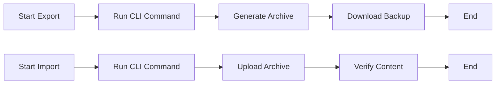

## Overview

Personalize your usama butt Documentation space by adjusting themes, branding, user permissions, and data management options. Use the brand color `#3B82F6` to match your identity. Follow these guides to tailor the environment precisely.

<Columns cols={3}>
  <Card title="Theme Setup" icon="palette" href="#theme-setup">
    Customize colors and styles.
  </Card>
  <Card title="Permissions" icon="shield" href="#permissions">
    Manage user access levels.
  </Card>
  <Card title="Export/Import" icon="upload" href="#export-import">
    Backup and migrate content.
  </Card>
</Columns>

## Theme and Branding Setup

Adjust your documentation's appearance starting with the primary brand color `#3B82F6`. Update the theme configuration file to apply changes site-wide.

<Steps>
  <Step title="Locate Config File" icon="search">
    Find `theme.json` in your project root.
  </Step>
  <Step title="Set Brand Color" icon="palette">
    Edit the `primaryColor` field.

    <CodeGroup tabs="JSON,YAML">
```json
{
  "colors": {
    "primary": "#3B82F6"
  }
}
```
```yaml
colors:
  primary: "#3B82F6"
```
    </CodeGroup>
  </Step>
  <Step title="Apply Changes" icon="refresh-cw">
    Run `npm run build` and redeploy.
  </Step>
</Steps>

<Callout kind="tip">
  Test color contrast with tools like WebAIM Contrast Checker to ensure accessibility.
</Callout>

<Expandable title="Advanced Branding" default-open="false">
  Add custom logos by setting `logo.src` to your image URL and `favicon.href` in the config.

  ```json
  {
    "branding": {
      "logo": {
        "src": "/images/usama-butt-logo.png"
      },
      "favicon": {
        "href": "/favicon.ico"
      }
    }
  }
  ```
</Expandable>

## User Permissions and Roles

Control access with predefined roles. Assign permissions via the admin dashboard or API.

<Tabs>
  <Tab title="Admin" icon="shield-check">
    Full access: edit, delete, manage users.
  </Tab>
  <Tab title="Editor" icon="edit-3">
    Edit and publish content, no user management.
  </Tab>
  <Tab title="Viewer" icon="eye">
    Read-only access.
  </Tab>
</Tabs>

| Role    | Edit Content | Manage Users | Delete Pages | Export Data |
|---------|--------------|--------------|--------------|-------------|
| Admin   | ✅           | ✅           | ✅           | ✅          |
| Editor  | ✅           | ❌           | ❌           | ✅          |
| Viewer  | ❌           | ❌           | ❌           | ❌          |

To assign roles, use the dashboard:

```bash
usama-butt users assign --email user@example.com --role editor
```

<Callout kind="alert">
  Review audit logs after permission changes to track activity.
</Callout>

## Export and Import Options

Backup your documentation or migrate between spaces using CLI commands.

<Steps>
  <Step title="Export Content" icon="download">
    ```bash
    usama-butt export --format md --output ./backup
    ```
  </Step>
  <Step title="Import Content" icon="upload">
    ```bash
    usama-butt import --source ./backup --overwrite false
    ```
  </Step>
  <Step title="Verify" icon="check-circle">
    Check the dashboard for import status.
  </Step>
</Steps>



These customizations ensure your usama butt Documentation space aligns with your branding and workflow needs. Experiment with the `#3B82F6` color for headers and buttons to create a cohesive look.