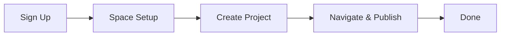

## Overview

Welcome to Usama Butt Documentation. Set up your account, configure your space, create your first project, and navigate the interface efficiently. Follow these steps to get productive in minutes.

<Callout kind="tip">
  Bookmark your dashboard after login for quick access to your spaces.
</Callout>

## Create Account and Log In

Begin by signing up and accessing your dashboard.

<Steps>
  <Step title="Visit the Sign-Up Page" icon="user-plus">
    Navigate to `https://usamabutt-docs.com/signup` in your browser.
  </Step>
  <Step title="Enter Details" icon="edit-3">
    Provide your email, create a strong password, and verify your account via email link.
  </Step>
  <Step title="Log In" icon="log-in">
    Return to `https://usamabutt-docs.com/login`, enter credentials, and land on the dashboard.
  </Step>
</Steps>

## Initial Space Setup

Customize your default documentation space with branding and preferences.

<Tabs>
  <Tab title="Web Interface" icon="globe">
    From the dashboard, select **Spaces** > **New Space**. Enter name `MyProjectDocs`, set brand color to `#3B82F6`, and save.
  </Tab>
  <Tab title="CLI Setup" icon="terminal">
    Install the CLI tool first.

    <CodeGroup tabs="npm,yarn">
```bash
npm install -g usamabutt-docs-cli
```
```bash
yarn global add usamabutt-docs-cli
```
    </CodeGroup>

    Then initialize:

    ```bash
    usamabutt-docs init --space "MyProjectDocs" --color "#3B82F6"
    ```
  </Tab>
</Tabs>

## Create Your First Project

Add a project to organize your docs.

<Steps>
  <Step title="New Project" icon="plus">
    In your space, click **Projects** > **Create Project**. Name it `QuickstartGuide`.
  </Step>
  <Step title="Add First Page" icon="file-plus">
    Select **Pages** > **New Page**. Choose `getting-started.mdx` and add frontmatter.
  </Step>
  <Step title="Publish" icon="upload-cloud">
    Preview changes, then click **Publish** to make live.
  </Step>
</Steps>

Here is sample frontmatter for your first page:

```yaml
---
title: My First Doc
description: Getting started content.
---
```

## Basic Navigation Tips

Master the interface quickly with these key areas.

<Columns cols={3}>
  <Card title="Dashboard" icon="layout" href="/dashboard">
    Overview of spaces and recent activity.
  </Card>
  <Card title="Spaces" icon="folders" href="/spaces">
    Manage documentation areas.
  </Card>
  <Card title="Projects" icon="package" href="/projects">
    Organize docs by project.
  </Card>
</Columns>

<Expandable title="Advanced Navigation Shortcuts" default-open="false">
  Use `Ctrl+K` for global search. Switch spaces with `Cmd+Shift+S` on macOS or `Ctrl+Shift+S` on Windows/Linux.
</Expandable>

## Next Steps

Explore API integration or team collaboration. Your space is ready—start documenting!

