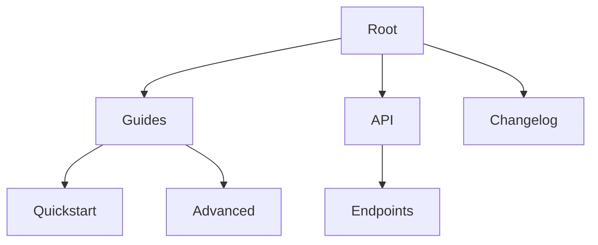

## Overview

You manage your `usama butt Documentation` space by creating pages, organizing hierarchies, collaborating with teams, and using version control. This guide walks you through essential practices to keep your docs clear and up-to-date. Start with structured pages and build a logical navigation for users.

<Callout kind="tip">

Use consistent naming like `quickstart.mdx` or `api-reference.mdx` for easy discovery.

</Callout>

## Creating and Editing Pages

Follow these steps to create your first page.

<Steps>
  <Step title="Create New Page" icon="plus">
    Navigate to your docs root in the file explorer. Click **New File** and name it `my-guide.mdx`.
  </Step>
  <Step title="Add Frontmatter" icon="edit-3">
    Insert YAML frontmatter at the top:

    ```yaml
    ---
    title: My Guide
    description: A brief overview.
    ---
    ```
  </Step>
  <Step title="Write Content" icon="pen-tool">
    Add H2 headings and components. Preview changes live.
  </Step>
  <Step title="Commit Changes" icon="git-commit">
    Save and commit with a clear message like `docs: add my-guide page`.
  </Step>
</Steps>

Edit pages using your preferred method.

<Tabs>
  <Tab title="Web Editor" icon="edit-3">
    Open the file in the browser editor. Make inline changes and use the preview pane.

    <Callout kind="info">
      Syntax highlighting supports MDX components automatically.
    </Callout>
  </Tab>
  <Tab title="Local IDE" icon="code">
    Clone the repo locally:

    ```bash
    git clone https://github.com/usama-butt/docs.git
    cd docs
    code .
    ```
  </Tab>
  <Tab title="CLI" icon="terminal">
    Use Git CLI for quick edits:

    ```bash
    git checkout -b feature/new-page
    echo "---\ntitle: New Page\n---\n\n## Content" > pages/new-page.mdx
    git add . && git commit -m "Add new page"
    git push origin feature/new-page
    ```
  </Tab>
</Tabs>

## Organizing Content Hierarchy

Structure your docs like a tree for intuitive navigation. Use folders and `sidebar.json` for custom menus.

| Level | Example Path | Purpose |
|-------|--------------|---------|
| Root | `/` | Landing page |
| Guides | `guides/quickstart.mdx` | User tutorials |
| API | `api/reference.mdx` | Endpoint docs |
| Changelog | `changelog.mdx` | Version history |



<Columns cols={2}>
  <Card title="Folder Structure" icon="folder" href="/docs/folder-setup">
    Mirror your repo: `pages/guides/`, `pages/api/`.
  </Card>
  <Card title="Sidebar Config" icon="menu" href="/docs/sidebar">
    Edit `sidebar.json` for nested menus and icons.
  </Card>
</Columns>

## Collaboration Features

Invite team members via GitHub repo settings. Use pull requests for reviews.

- Assign reviewers for doc changes
- Add comments on specific lines
- Merge after approval

<ExpandableGroup>
  <Expandable title="Resolve Conflicts" default-open="false">
    When merging branches:

    1. Pull latest: `git pull origin main`
    2. Resolve in your editor
    3. Commit: `git commit -m "Resolve conflicts"`
  </Expandable>
</ExpandableGroup>

## Version Control Basics

Track changes with Git. Commit often with descriptive messages.

<CodeGroup tabs="Branching,Releasing">
  ```bash
  # Create feature branch
  git checkout -b docs/improve-index
  git add .
  git commit -m "docs: enhance index page with components"
  git push origin docs/improve-index
  ```
  ```bash
  # Tag releases
  git tag v1.0.0
  git push origin v1.0.0
  ```
</CodeGroup>

<Callout kind="success">

Regular commits ensure rollback safety. Use `git log --oneline` to review history.

</Callout>